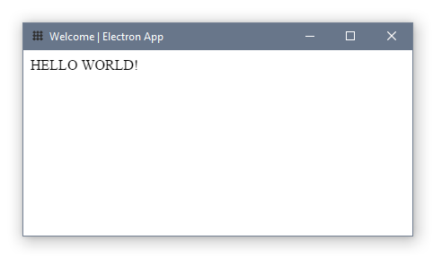
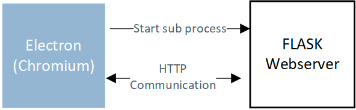

# Electron-Flask Bootstrap Template




### Dependencies

| Python 3.9 | NodeJS 16.x |  |
| ---------- | ----------- | ------------------------------------------------------------ |


### Installation

1. Clone the repository `git clone ...`
2. Install Python dependencies `python -m pip install -r requirements.txt`
3. Install node modules `npm install`


### Running the App

**Start app**
- Windows: `.\node_modules\.bin\electron .`
- Mac OS/Linux: `./node_modules/.bin/electron .`

**Start app with globally installed electron**

- `electron .`

**Run the app through your web browser**

- Start Flask server manually: `python web_app/run_app.py`


### Bundling

Packaging is done in two steps:

1. A standalone Python executable containing the Flask backend is generated using _PyInstaller_
2. The Python executable and the electron application (`electron.js`) are bundled using _electron-builder_

> **NOTE:** The Python executable is generated in the "one-file-mode"; All dependencies are wrapped in a single executable. When executed, the program is decompressed to a temporary directory and run in a **second process** from there. This has to be considered in the life-cycle management of the electron app. See `killPythonSubprocesses` of `electron.js`.

**Package the app for the host platform**

- `npm run package ` (output binaries will be stored in `/dist`)

**Cross-Platform packaging**

- Not yet supported (due to lacking cross-compilation support of _PyInstaller_)


## Why Flask?

- Using a Flask webserver for interprocess communication (ICP) comes in handy to bundle an existing Flask-based service into a desktop application. The endpoints don't have to be changed.
- For other applications there are more efficient alternatives to using Flask/HTTP for ICP, e.g. [zerorpc](https://www.zerorpc.io/).




## Encountered Issues

- asar is read-only, .pyc files cannot be created
- When bundling the standalone Python executable in an .asar, a random filename is generated. This makes life-cycle management of the backend service difficult (see also section _Bundling_).


## Feature Backlog

**Bundling Resources with the Python Executable**

- use `--add-data` to bundle resources with the python executables (use `sys._MEIPASS` to resolve paths)

- see https://github.com/ChrisKnott/Eel/issues/57

```
def resource_path(relative_path):
    """ Get absolute path to resource, works for dev and for PyInstaller """
    if hasattr(sys, '_MEIPASS'):
        return os.path.join(sys._MEIPASS, relative_path)
    return os.path.join(os.path.abspath("."), relative_path)
```

**Cross-Compilation through Docker**

- create a Docker image to allow building for Linux on Windows

**ASAR Bundling**

- When bundling the electron app in an .asar, the path to the python executable (which is copied to the resource folder) is not resolved properly
